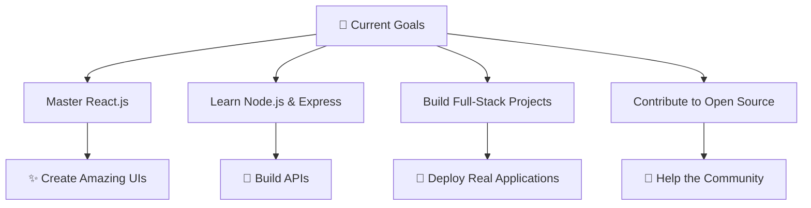

<div align="center">
  
# Hi there, I'm Sobiya Vhora! 👋

### 💫 Passionate Developer | Problem Solver | Tech Enthusiast


</div>

---

## 🚀 About Me

```javascript
const sobiya = {
    pronouns: "she/her",
    location: "India 🇮🇳",
    currentFocus: "Full Stack Development",
    learning: ["React", "Node.js", "MongoDB", "Python"],
    askMeAbout: ["Web Development", "JavaScript", "UI/UX Design"],
    funFact: "I debug with console.log and I'm not ashamed! 😄"
};
```

<div align="center">

### 🌟 Quick Stats

<table>
<tr>
<td align="center">

</td>
<td align="center">

</td>
<td align="center">

</td>
<td align="center">

</td>
</tr>
</table>

</div>

---

## 🛠️ Tech Stack & Tools

<div align="center">

### 💻 Programming Languages


### 🚀 Frameworks & Libraries


### 🗄️ Databases


### 🛠️ Tools & Platforms


</div>

---

## 📊 GitHub Analytics

<div align="center">


</div>

<div align="center">

### 🔥 GitHub Streak Stats


</div>

---

## 🏆 GitHub Achievements

<div align="center">


</div>

---

## 📈 Contribution Graph

<div align="center">


</div>

---

## 🎯 Current Focus

<div align="center">



</div>

---

## 🌟 Featured Projects

<div align="center">

<a href="https://github.com/SobiyaMariyam/awesome-project-1">
  
</a>

<a href="https://github.com/SobiyaMariyam/awesome-project-2">
  
</a>

</div>

---

## 💡 Fun Facts About Me

<div align="center">

| 🎵 | I code better with music on |
|:---:|:---:|
| ☕ | Coffee is my debugging fuel |
| 🌙 | Night owl programmer |
| 📚 | Always learning something new |
| 🎨 | Love creating beautiful UIs |
| 🐛 | I speak fluent "Error Message" |

</div>

---

## 📫 Let's Connect!

<div align="center">

<a href="mailto:sobiya@example.com">
  
</a>

<a href="https://linkedin.com/in/sobiya-vhora" target="_blank">
  
</a>

<a href="https://twitter.com/SobiyaVhora" target="_blank">
  
</a>

<a href="https://instagram.com/sobiya.dev" target="_blank">
  
</a>

</div>

---

## 💭 Random Dev Quote

<div align="center">


</div>

---

## 🎊 Thanks for Visiting!

<div align="center">


### 💖 Show some love by starring some repositories!

</div>

---

<div align="center">
  
</div>
