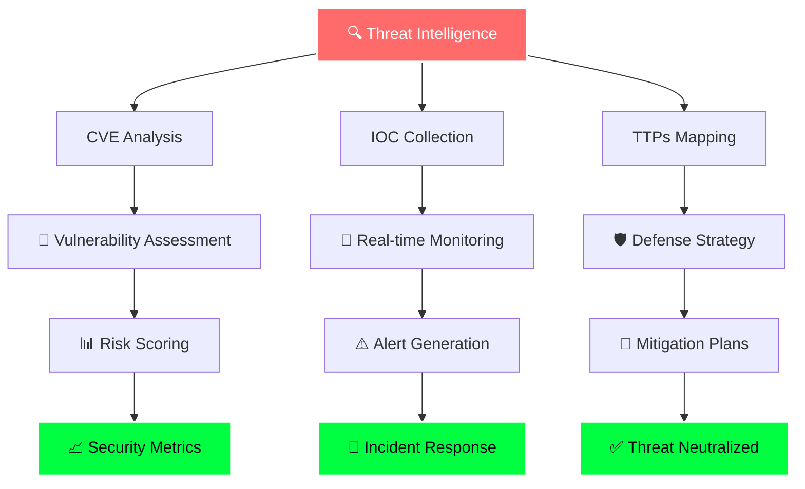

<div align="center">

# 🔐 Sobiya Vhora | Cybersecurity Specialist 👨‍💻


</div>

---

## 🔥 Security Specialist Profile

```python
class CyberSecuritySpecialist:
    def __init__(self):
        self.name = "Sobiya Vhora"
        self.role = "Cybersecurity Analyst"
        self.current_work = {
            "position": "SOC Analyst Level II",
            "company": "CyberDefense Corp",
            "responsibilities": [
                "🔍 Threat Hunting & Analysis",
                "🚨 Incident Response Management", 
                "🛡️ Security Monitoring (SIEM/SOAR)",
                "📊 Risk Assessment & Reporting",
                "🔒 Vulnerability Management"
            ]
        }
        self.specializations = [
            "Penetration Testing",
            "Digital Forensics", 
            "Malware Analysis",
            "Network Security",
            "Cloud Security (AWS/Azure)"
        ]
        self.current_projects = [
            "Building Custom SIEM Rules",
            "Automated Threat Intelligence Platform",
            "Red Team Simulation Tools"
        ]
        
    def daily_routine(self):
        return [
            "☕ Coffee + Threat Intelligence Briefing",
            "🔍 Hunt for Advanced Persistent Threats", 
            "📈 Analyze Security Metrics & KPIs",
            "🛠️ Develop Security Automation Scripts",
            "📚 Study Latest CVEs & Attack Vectors"
        ]
```

---

## 🛡️ Cybersecurity Arsenal

<div align="center">

### 🔧 Security Tools & Frameworks


### 🛠️ SIEM & Monitoring


### ☁️ Cloud Security


### 💻 Programming & Scripting


</div>

---

## 📊 Security Analytics Dashboard

<div align="center">


</div>

<div align="center">

### ⚡ Threat Detection Streak


</div>

---

## 🚨 Threat Intelligence Feed

<div align="center">



</div>

---
## 🔒 Security Mindset

<div align="center">

| 🛡️ Defense | 🎯 Offense | 📊 Analysis | 🤖 Automation |
|:---:|:---:|:---:|:---:|
| Think like an attacker | Red team exercises | Data-driven decisions | Script everything |
| Defense in depth | Vulnerability research | Pattern recognition | AI-powered detection |
| Zero trust architecture | Exploit development | Threat modeling | SOAR playbooks |
| Incident response | Social engineering | Risk assessment | Custom tools |

</div>

---

## 🌐 Cyber Threat Landscape

<div align="center">


</div>

---
## 🚨 Threat Intelligence Quote

<div align="center">


</div>

---

<div align="center">


### 🔐 "Security is not a product, but a process" - Bruce Schneier

</div>

---
